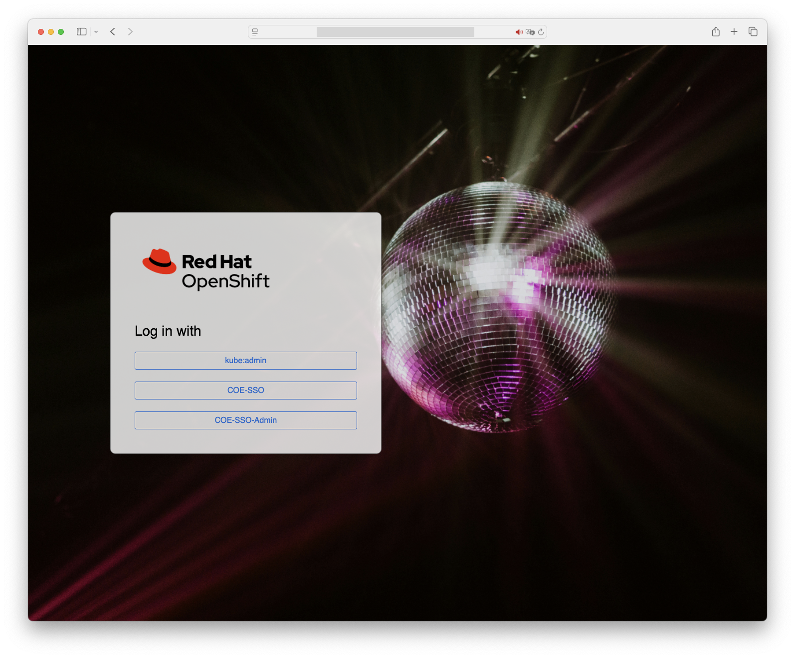
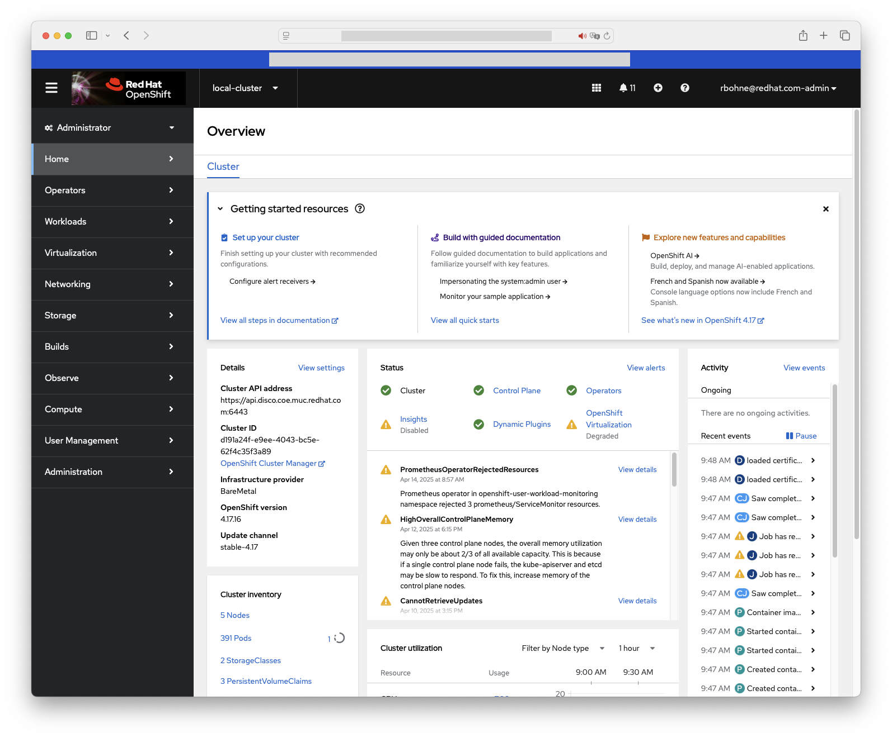

# OpenShift WebUI customization examples

## Disco

```shell
oc create -n openshift-config -k disco/namespace/openshift-config/
oc apply -k disco/cluster-scope
```
|Login page|Web console|
|---|---|
|||

